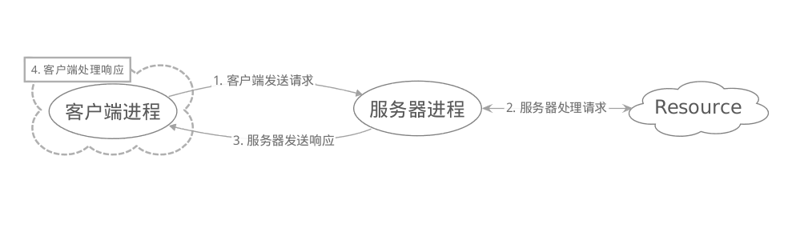
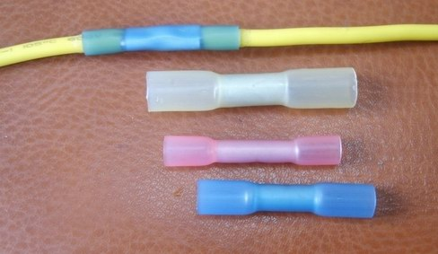
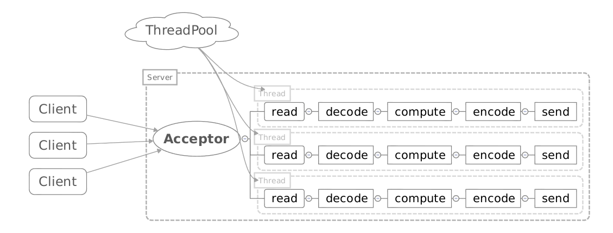
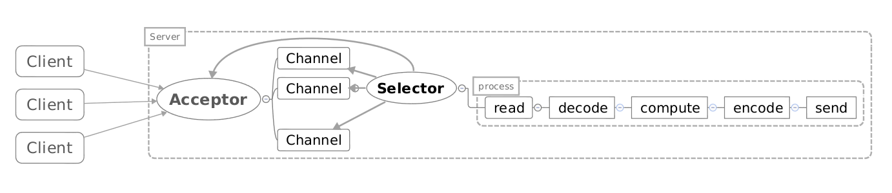
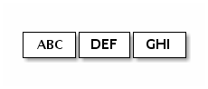
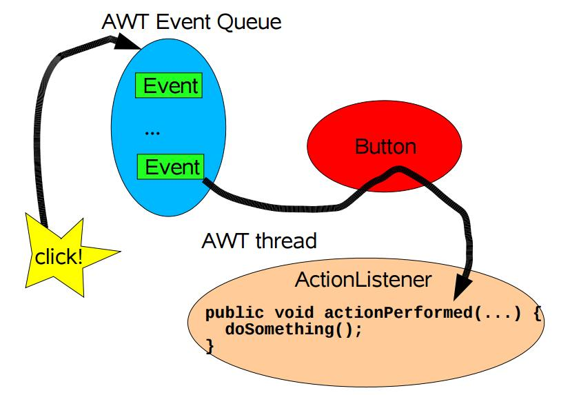
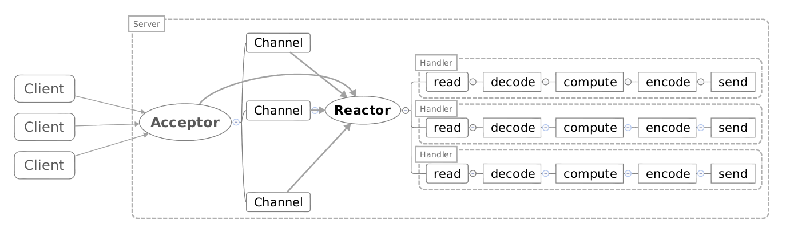
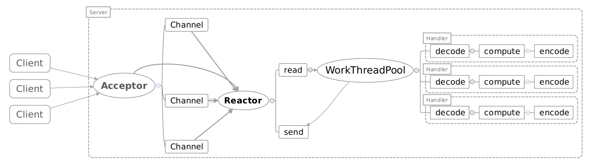
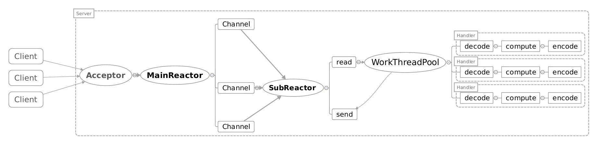
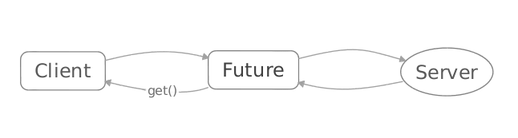

% 高性能服务器
% IO模型
% 王一帆

## 目录

- 客户端-服务器模型
- BIO
- NIO
- Reactor模型
- Netty
- Pigeon

## 客户端-服务器模型



## 什么是服务器?

. . .

服务器管理某种资源，并且通过操作这种资源来为它的客户端提供某种服务

## 高性能服务器

- 高可用
- 效率高
- 编程简单
- 可扩展
- 可移植

## Socket

. . .

- 套接字是什么鬼？

. . .



##


## 阻塞IO/非阻塞IO/同步IO/异步IO

. . .

- 一个IO操作其实分成了两个步骤:发起IO请求和实际的IO操作
- 阻塞IO和非阻塞IO的区别在于第一步：发起IO请求是否会被阻塞，如果阻塞直到完成那么就是传统的阻塞IO;如果不阻塞，那么就是非阻塞IO
- 同步IO和异步IO的区别就在于第二个步骤是否阻塞，如果实际的IO读写阻塞请求进程，那么就是同步IO，因此阻塞IO、非阻塞IO、IO复用、信号驱动IO都是同步IO;如果不阻塞，而是操作系统帮你做完IO操作再将结果返回给你，那么就是异步IO

## BIO

## 客户端代码

```java
Socket client = new Socket("127.0.0.1",7777);    
PrintWriter pw = new PrintWriter(client.getOutputStream());  
BufferedReader br=new BufferedReader(new InputStreamReader(System.in));  
pw.write(br.readLine());  
pw.close();  
br.close();
```

## 服务端代码

```java
Socket socket;  
ServerSocket ss = new ServerSocket(7777);  
while (true) {  
    socket = ss.accept();  
    //new Thread()
    BufferedReader br = new BufferedReader(new InputStreamReader(socket  
                    .getInputStream()));  
    System.out.println("you input is : " + br.readLine());  
}
```

## 图示



## 优缺点

. . .

- 优点
    - 模型简单
    - 编码简单

. . .

- 缺点
    - 性能瓶颈低

## NIO

- New IO?
- Non-Blocking IO?

## 客户端代码(连接)

```java
//获取socket通道
SocketChannel channel = SocketChannel.open();        
channel.configureBlocking(false);
//获得通道管理器
selector=Selector.open();        
channel.connect(new InetSocketAddress(serverIp, port));
//为该通道注册SelectionKey.OP_CONNECT事件
channel.register(selector, SelectionKey.OP_CONNECT);
```

## 客户端代码(监听)

```java
while(true){
   selector.select();//选择注册过的io操作的事件(第一次为SelectionKey.OP_CONNECT)
   while(SelectionKey key : selector.selectedKeys()){
       if(key.isConnectable()){
           SocketChannel channel=(SocketChannel)key.channel();
           if(channel.isConnectionPending()){
               channel.finishConnect();//如果正在连接，则完成连接
           }
           channel.register(selector, SelectionKey.OP_READ);
       }else if(key.isReadable()){ //有可读数据事件。
           SocketChannel channel = (SocketChannel)key.channel();
           ByteBuffer buffer = ByteBuffer.allocate(10);
           channel.read(buffer);
           byte[] data = buffer.array();
           String message = new String(data);
           System.out.println("recevie message from server:, size:" + buffer.position() + " msg: " + message);
       }
   }
}
```

## 服务端代码(连接)

```java
//获取一个ServerSocket通道
ServerSocketChannel serverChannel = ServerSocketChannel.open();
serverChannel.configureBlocking(false);
serverChannel.socket().bind(new InetSocketAddress(port));
//获取通道管理器
selector = Selector.open();
//将通道管理器与通道绑定，并为该通道注册SelectionKey.OP_ACCEPT事件，
serverChannel.register(selector, SelectionKey.OP_ACCEPT);
```

## 服务端代码(监听)

```java
while(true){
   selector.select();//当有注册的事件到达时，方法返回，否则阻塞。
   for(SelectionKey key : selector.selectedKeys()){
       if(key.isAcceptable()){
           ServerSocketChannel server = (ServerSocketChannel)key.channel();
           SocketChannel channel = server.accept();
           channel.write(ByteBuffer.wrap(new String("send message to client").getBytes()));
           //在与客户端连接成功后，为客户端通道注册SelectionKey.OP_READ事件。
           channel.register(selector, SelectionKey.OP_READ);
       }else if(key.isReadable()){//有可读数据事件
           SocketChannel channel = (SocketChannel)key.channel();
           ByteBuffer buffer = ByteBuffer.allocate(10);
           int read = channel.read(buffer);
           byte[] data = buffer.array();
           String message = new String(data);
           System.out.println("receive message from client, size:" + buffer.position() + " msg: " + message);
       }
   }
}
```

## 图示



## 优缺点

. . .

- 优点
    - 性能瓶颈高

. . .

- 缺点
    - 模型复杂
    - 编码复杂
    - 需处理半包问题

## 半包问题




## Reactor模型

## AWT Events



## Reactor中的组件

- Reactor:Reactor是IO事件的派发者。
- Acceptor:Acceptor接受client连接，建立对应client的Handler，并向Reactor注册此Handler。
- Handler:和一个client通讯的实体，按这样的过程实现业务的处理。一般在基本的Handler基础上还会有更进一步的层次划分， 用来抽象诸如decode，process和encoder这些过程。比如对Web Server而言，decode通常是HTTP请求的解析， process的过程会进一步涉及到Listner和Servlet的调用。业务逻辑的处理在Reactor模式里被分散的IO事件所打破， 所以Handler需要有适当的机制在所需的信息还不全（读到一半）的时候保存上下文，并在下一次IO事件到来的 时候（另一半可读了）能继续中断的处理。为了简化设计，Handler通常被设计成状态机，按GoF的state pattern来 实现。

## Reactor单线程模型



## Reactor多线程模型



## 主从Reactor模型



## Netty

- Netty是一个高性能NIO框架

## Netty客户端代码

```java
EventLoopGroup workerGroup = new NioEventLoopGroup();
try {
    Bootstrap b = new Bootstrap();
    b.group(workerGroup);
    b.channel(NioSocketChannel.class);
    b.option(ChannelOption.SO_KEEPALIVE, true);
    b.handler(new ChannelInitializer<SocketChannel>() {
        @Override
        public void initChannel(SocketChannel ch) throws Exception {
            ch.pipeline().addLast(new TimeClientHandler());
        }
    });

    ChannelFuture f = b.connect(host, port).sync();

    f.channel().closeFuture().sync();
} finally {
    workerGroup.shutdownGracefully();
}
```

## Netty Client Handler

```java
public class TimeClientHandler extends ChannelInboundHandlerAdapter {
    @Override
    public void channelRead(ChannelHandlerContext ctx, Object msg) {
        ByteBuf m = (ByteBuf) msg;
        try {
            long currentTimeMillis = (m.readUnsignedInt() - 2208988800L) * 1000L;
            System.out.println(new Date(currentTimeMillis));
            ctx.close();
        } finally {
            m.release();
        }
    }

    @Override
    public void exceptionCaught(ChannelHandlerContext ctx, Throwable cause) {
        cause.printStackTrace();
        ctx.close();
    }
}
```

## Netty服务端代码

```java
EventLoopGroup bossGroup = new NioEventLoopGroup();
EventLoopGroup workerGroup = new NioEventLoopGroup();
try {
    ServerBootstrap b = new ServerBootstrap();
    b.group(bossGroup, workerGroup)
     .channel(NioServerSocketChannel.class)
     .childHandler(new ChannelInitializer<SocketChannel>() {
         @Override
         public void initChannel(SocketChannel ch) throws Exception {
             ch.pipeline().addLast(new TimeServerHandler());
         }
     })
     .option(ChannelOption.SO_BACKLOG, 128)  
     .childOption(ChannelOption.SO_KEEPALIVE, true);
    // Bind and start to accept incoming connections.
    ChannelFuture f = b.bind(port).sync();
    f.channel().closeFuture().sync();
} finally {
    workerGroup.shutdownGracefully();
    bossGroup.shutdownGracefully();
}
```

## Netty Server Handler

```java
public class TimeServerHandler extends ChannelInboundHandlerAdapter {

    @Override
    public void channelActive(final ChannelHandlerContext ctx) {
        final ByteBuf time = ctx.alloc().buffer(4);
        time.writeInt((int) (System.currentTimeMillis() / 1000L + 2208988800L));

        final ChannelFuture f = ctx.writeAndFlush(time);
        f.addListener(new ChannelFutureListener() {
            @Override
            public void operationComplete(ChannelFuture future) {
                assert f == future;
                ctx.close();
            }
        });
    }

    @Override
    public void exceptionCaught(ChannelHandlerContext ctx, Throwable cause) {
        cause.printStackTrace();
        ctx.close();
    }
}
```

## Netty的问题

- 回调机制打破了线性编码习惯
- Callback Hell

## Callback Hell

```java
a.doing1();
a.doing2();
a.doing3();
```
. . .

```java
a.doing1(new Callback(){
    public void callback(){
        a.doing2(new Callback(){
            public void callback(){
                a.doing3();
            }
        })
    }
});
```

## Pigeon

- 简化Netty的使用
- 同步响应

## Pigeon的实现



## Pigeon后续规划

- 构建Netty,Mina,Thrift等框架的抽象

## 参考资料

- [Reactor论文](http://www.dre.vanderbilt.edu/~schmidt/PDF/reactor-siemens.pdf)
- [Doug Lea《Scalable IO in Java》](http://gee.cs.oswego.edu/dl/cpjslides/nio.pdf)
- [Netty源码](https://github.com/netty/netty)
- [剖析Disruptor:为什么会这么快？](http://mechanitis.blogspot.com/2011/07/dissecting-disruptor-why-its-so-fast.html)
- [剖析Disruptor:为什么会这么快？(中文)](http://ifeve.com/locks-are-bad/)
- [Java SE1.6中的Synchronized](http://ifeve.com/java-synchronized/)
- [线程安全的无锁RingBuffer实现](http://www.cnblogs.com/l00l/p/4115001.html)
- [Java NIO类库Selector机制解析（上）](http://blog.csdn.net/haoel/article/details/2224055)
- [Java NIO类库Selector机制解析（下）](http://blog.csdn.net/haoel/article/details/2224069)

# 谢谢
