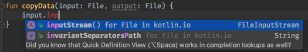
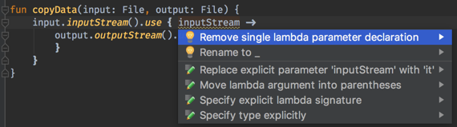

title: 使用Kotlin实现一个虚拟机
speaker: 王一帆
url: http://ivaneye.com
transition: stick
theme: dark

[slide]
# 使用Kotlin实现一个虚拟机
## 王一帆

[slide]
## 源起

-   {:&.moveIn}
- 《自己动手写Java虚拟机》
- JVM是如何运行的？

[slide]
## Kotlin简介

[slide]
## 简洁

- 使用一行代码创建一个包含 getters、 setters、 equals()、 hashCode()、 toString() 以及 copy() 的 POJO：

```kotlin
data class Customer(val name: String, val email: String, val company: String)
```

[slide]
- 或者使用 lambda 表达式来过滤列表：

```kotlin
val positiveNumbers = list.filter { it > 0 }
```

[slide]
- 想要单例？创建一个 object 就可以了：

```kotlin
object ThisIsASingleton {
    val companyName: String = "JetBrains"
}
```

[slide]
## 安全

- 彻底告别那些烦人的 NullPointerException，毕竟价值万亿。

```kotlin
var output: String
output = null   // 编译错误
```

[slide]
- Kotlin 可以保护你避免对可空类型的误操作

```kotlin
val name: String? = null    // 可控类型
println(name.length())      // 编译错误
```

[slide]
- 并且如果你检查类型是正确的，编译器会为你做自动类型转换

```kotlin
fun calculateTotal(obj: Any) {
    if (obj is Invoice)
        obj.calculateTotal()
}
```

[slide]
## 互操作性

- 使用 JVM 上的任何现有库，因为有 100％ 的兼容性，包括 SAM 支持。

```kotlin
import io.reactivex.Flowable
import io.reactivex.schedulers.Schedulers

Flowable
    .fromCallable {
        Thread.sleep(1000) //  模仿高开销的计算
        "Done"
    }
    .subscribeOn(Schedulers.io())
    .observeOn(Schedulers.single())
    .subscribe(::println, Throwable::printStackTrace)
```

[slide]
- 无论是 JVM 还是 JavaScript 目标平台，都可用 Kotlin 写代码然后部署到你想要的地方

```kotlin
import kotlin.browser.window

fun onLoad() {
    window.document.body!!.innerHTML += "<br/>Hello, Kotlin!"
}
```

[slide]
## 工具化

一门语言需要工具化，而在 JetBrains，这正是我们做得最好的地方！





[slide]
## 吸引我的地方

- JetBrains
- 谷歌宣布Kotlin作为Android主力语言
- 扩展方法

[slide]
## Java/Class路径查找

[slide]
## Class文件结构

[slide]
## 整体结构

- 图见XMind
- 长度+内容
- 优缺点
- 类似的结构

[slide]
## magic

- 文件类型判断
- windows后缀判断文件类型的弊端

[slide]
##

[slide]
# 谢谢
