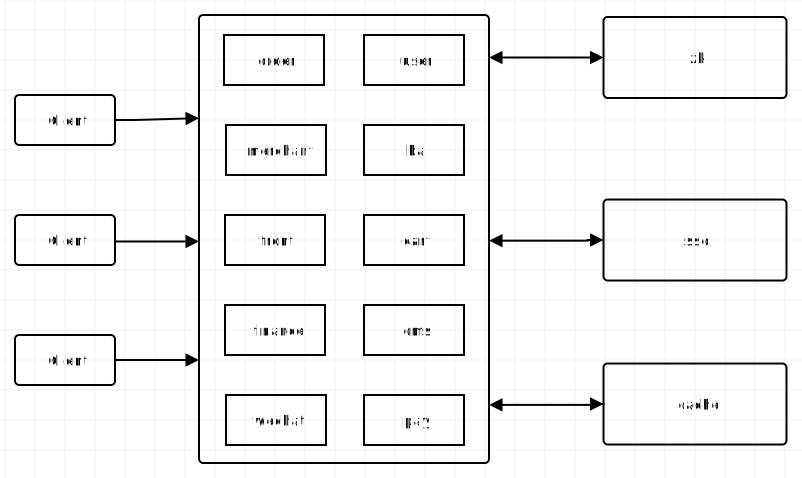

# 整体架构

# 通用目录结构

- api：当前项目所对外提供的接口
- app：项目应用Controller[web]?
- ba：项目平台Controller[web]?
- common：当前项目下的通用的依赖、工具类与常量类
- dubbo-api：当前项目下需要发布到dubbo的服务配置
- metadata：后端业务逻辑代码，包括Service、Domain、DAO、Mybatis相关代码
- service-app：提供给api和app使用的服务
- service-ba：提供给ba使用的服务
