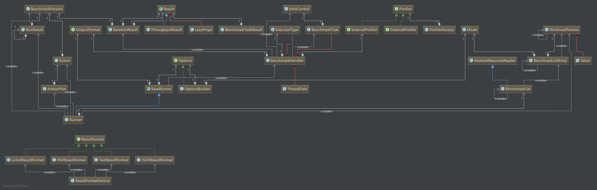

# 什么是基准测试

# 什么是微基准测试

# 什么是JMH

# 简单示例

```java
import org.openjdk.jmh.annotations.Benchmark;
import org.openjdk.jmh.annotations.BenchmarkMode;
import org.openjdk.jmh.annotations.Mode;
import org.openjdk.jmh.profile.ClassloaderProfiler;
import org.openjdk.jmh.results.format.ResultFormatType;
import org.openjdk.jmh.runner.Runner;
import org.openjdk.jmh.runner.RunnerException;
import org.openjdk.jmh.runner.options.Options;
import org.openjdk.jmh.runner.options.OptionsBuilder;

public class MyBenchmark {

    @Benchmark
    @BenchmarkMode(Mode.AverageTime)
    public void testMethod() {
        int a = 1;
        int b = 2;
        int sum = a + b;
    }

    public static void main(String[] args) throws RunnerException {
        Options opt = new OptionsBuilder()
                .include(MyBenchmark.class.getSimpleName())
                .forks(0)
                .resultFormat(ResultFormatType.JSON)
                .result("d:/temp.txt")
                .addProfiler(ClassloaderProfiler.class)
                .build();

        new Runner(opt, new JMHOutputFormat()).run();
    }
}
```

# 执行流程

- OptionsBuilder构建Options的辅助类，通过流式接口来构建Options
- Runner为执行基准测试的类
    - 接收Options作为参数
    - 可以通过自定义OutputFormat来自定义需要的输出结果，比如将结果写到网络
    - 调用run方法进行执行
- run方法中：
    - 首先通过文件锁(锁定System.getProperty("java.io.tmpdir") + "/jmh.lock")来锁定资源执行，**此处如果想同时执行多个基准测试就存在问题，需要考量！考虑使用JCGroup隔离运行环境**
    - 如果锁定成功，执行internalRun方法。
    - 如果锁定失败，且必须要锁定(判断Boolean.getBoolean("jmh.ignoreLock"))，则抛出异常；
    - 如果不必须锁定，打印日志，继续执行internalRun方法
- internalRun中：
    - 验证在Options中配置的Profiles是否有效，无效则抛ProfilersFailedException
    - 如果在Options中设置了result，则创建对应的文件
    - 根据includes和excludes配置，从BenchmarkList中查找匹配的Benchmark，正则表达式匹配，过滤出当前需要执行的测试用例
    - 针对编写的基准测试用例，JMH会自动生成一个/META-INF/BenchmarkList文件，里面记录了基准测试用例相关信息，BenchmarkList类就是从此文件中加载基准测试用例信息
    - 如果设置了Mode，则将Mode设置到过滤出来的测试用例中，注意此处使用的是clone，通过原来的测试用例的参数构建的新的测试用例，防止污染从文件里加载的测试用例信息。下面又针对Mode.All的用例clone了一遍，因为上面的clone没有涉及到Mode.All的情况
    - 针对有parameters的情况，再clone一遍测试用例
    - 执行这些测试用例runBenchmarks()：
        - 根据ActionPlan类型来确定是执行runBenchmarksEmbedded还是runSeparate
        - 而ActionPlan的类型主要通过Options中的fork参数来判断,<=0为EMBEDED，否则为FORKED
        - **P1**:runBenchmarksEmbedded()：
            - 遍历ActionPlan中的Action进行执行，Action中包含了执行的参数和模式，最终执行单元是通过参数、模式以及Acceptor（一个回调类）构建的BenchMarkHandler
            - 在BenchMarkHandler的runIteration里，执行了具体的测试，包括各种Profile的执行和测试的最终执行
        - **P2**:runSeparate()：
            - 通过ProcessorBuilder来构建进程进行执行,相当于构建了一个独立的运行环境
            - 将测试用例丢到运行环境内进行运行
    - 通过设置的ResultFormat格式化结果，并输出



## JMH组件

- Runner：执行JMH测试
- Result：JMH执行结果
- ResultFormat：结果格式
- OutputFormat：输出格式
- Options：执行JMH的参数

## JMH包结构

jmh-core中包含了7个包：
- annotations：没什么可说的了，JMH中的注解
- generators.core：用于生成JMH相关代码
- infra：对被测试的方法的资源消耗的一些模拟类(暂未搞清楚)
- profile：各种自定义监控类，类似Filter，通过OptionsBuilder.addProfiler构建profile链，增加感兴趣的监控点
- results：JMH执行结果
- runner：执行JMH的相关类
- util：工具类

## 测试模式

JMH支持如下几种测试模式，可以通过@BenchmarkMode注解进行配置！

|Name|	Description|
|----|----|
|Mode.Throughput|	计算单位时间内的操作次数，吞吐量|
|Mode.AverageTime|	计算运行平均时间|
|Mode.SampleTime|	计算方法运行时间|
|Mode.SingleShotTime|	计算一个批次执行的总时间，批次可配置，可执行一次，也可执行多次|
|Any set of these modes|	可设置多次，进行多次执行|
|Mode.All|	依次执行所有的模式|

默认模式是：Throughput.

```java
package com.jenkov;

import org.openjdk.jmh.annotations.Benchmark;
import org.openjdk.jmh.annotations.BenchmarkMode;
import org.openjdk.jmh.annotations.Mode;

public class MyBenchmark {

    @Benchmark
    @BenchmarkMode(Mode.Throughput)
    public void testMethod() {
        int a = 1;
        int b = 2;
        int sum = a + b;
    }
}
```

## 时间单位

通过@OutputTimeUnit注解可以设置测试的时间单位，参数为java.util.concurrent.TimeUnit

```java
package com.jenkov;

import org.openjdk.jmh.annotations.Benchmark;
import org.openjdk.jmh.annotations.BenchmarkMode;
import org.openjdk.jmh.annotations.Mode;
import org.openjdk.jmh.annotations.OutputTimeUnit;

import java.util.concurrent.TimeUnit;

public class MyBenchmark {

    @Benchmark
    @BenchmarkMode(Mode.Throughput)
    @OutputTimeUnit(TimeUnit.MINUTES)
    public void testMethod() {
        int a = 1;
        int b = 2;
        int sum = a + b;
    }
}
```

## 测试状态类

**状态类** 是我个人的理解，代码表现出来就是被@State注解的类，用于保持测试的运行状态：包括初始状态、中间状态或最终状态！

当在做基准测试的时候，可能有这样的诉求

- 需要初始化一些数据
- 保持测试运行时的中间状态
- 或者保持测试运行的结果

那么可以使用JMH提供的状态类来解决！满足如下条件的类我们可以称其为状态类:

- 默认构造方法
- 是公开类(public class)
- 如果是内部类则必须是static的
- 类必须被@State注解

```java
package com.jenkov;

import org.openjdk.jmh.annotations.*;
import java.util.concurrent.TimeUnit;

public class MyBenchmark {

    @State(Scope.Thread)
    public static class MyParam {
        public int num = 2;
    }

    @Benchmark
    @BenchmarkMode(Mode.Throughput)
    @OutputTimeUnit(TimeUnit.MINUTES)
    public void testMethod(MyParam param) {
        int a = param.num;
        int b = 2;
        int sum = a + b;
    }
}
```

@State注解可以定义状态类的作用范围。JMH支持在多个线程里运行测试，所以请选择合适的作用范围！

|Name	|Description|
|----|----|
|Scope.Thread|	默认状态，每个线程里都会有一个状态类实例|
|Scope.Benchmark|	所有运行相同测试的线程共享这个状态类实例，此作用范围可以用来测试并发性能|
|Scope.Group|	一个线程组一个实例|

除了使用独立的类作为基准测试状态类。你也可以使用基准测试类作为状态类，只要在基准测试类上添加@State注解即可。所有规则都适用这个状态类！

## State housekeeping

类似JUnit的测试类，你可以在状态类的方法上设置@Setup和@TearDown使其成为初始化方法或销毁方法！这些方法不会消耗测试时间！

```java
package com.jenkov;

import org.openjdk.jmh.annotations.*;
import java.util.concurrent.TimeUnit;

public class MyBenchmark {

    @State(Scope.Thread)
    public static class MyState {

        @Setup(Level.Trial)
        public void doSetup() {
            sum = 0;
            System.out.println("Do Setup");
        }

        @TearDown(Level.Trial)
        public void doTearDown() {
            System.out.println("Do TearDown");
        }
        public int a = 1;
        public int b = 2;
        public int sum ;
    }

    @Benchmark
    @BenchmarkMode(Mode.Throughput)
    @OutputTimeUnit(TimeUnit.MINUTES)
    public void testMethod(MyState state) {
        state.sum = state.a + state.b;
    }
}
```

你可以通过注解中的Level参数来配置何时调用初始化与销毁方法！

|Name|	Description|
|----|----|
|Level.Trial|	默认level。进入测试前调用初始化方法，结束后调用销毁方法|
|Level.Iteration	|在一个循环执行的开始执行初始化方法，结束时执行销毁方法|
|Level.Invocation	|开始每一个方法前执行初始化方法，方法结束时执行销毁方法|

## Dead code

Dead code elimination is a well known problem among microbenchmark writers. The general solution is to use the result of calculations somehow. JMH does not do any magic tricks on its own. If you want to defend against dead code elimination – never write void tests. Always return the result of your calculations. JMH will take care of the rest.

If you need to return more than one value from your test, either combine all return values with some cheap operation (cheap compared to the cost of operations by which you got your results) or use a BlackHole method argument and sink all your results into it (note that BlockHole.consume may be more expensive than manual combining of results in some cases). BlackHole is a thread-scoped class:

```java
@Benchmark
public void testSomething(BlackHole bh){
    bh.consume(Math.sin(state_field));
    bh.consume(Math.cos(state_field));
}
```

Constant folding

If result of your calculation is predictable and does not depend on state objects, it is likely to be optimized by JIT. So, always read the test input from a state object and return the result of your calculations. This rule is mostly related to the case of a single return value. Using BlackHole object makes it much harder for JVM to optimize it (but not impossible!). Both methods in the following test will not be optimized.

```java
private double x = Math.PI;

@Benchmark
public void bhNotQuiteRight( BlackHole bh ){
    bh.consume( Math.sin( Math.PI ));
    bh.consume( Math.cos( Math.PI ));
}

@Benchmark
public void bhRight( BlackHole bh ){
    bh.consume( Math.sin( x ));
    bh.consume( Math.cos( x ));
}
```

Things are getting more complicated in case of a method returning a single value. The following tests will not be optimized, but if you will replace Math.sin with Math.log, then testWrong method will be replaced with a constant value:

```java
private double x = Math.PI;

@Benchmark
public double testWrong()
{
    return Math.sin( Math.PI );
}

@Benchmark
public double testRight()
{
    return Math.sin( x );
}
```

So, in order to make your tests reliable, stick to the following rule: always read the test input from a state object and return the result of your calculations.

Loops


Do not use loops in your tests. JIT is too smart and often does magic tricks with loops. Test the actual calculation and let JMH to take care of the rest.

In case of non-uniform cost operations (for example, you test time to process a list which grows after each test) you may want to use @BenchmarkMode(Mode.SingleShotTime) with @Measurement(batchSize = N). But you must not implement test loops yourself!

Forks

By default JHM forks a new java process for each trial (set of iterations). This is required to defend the test from previously collected “profiles” – information about other loaded classes and their execution information. For example, if you have 2 classes implementing the same interface and test the performance of both of them, then the first implementation (in order of testing) is likely to be faster than the second one (in the same JVM), because JIT replaces direct method calls to the first implementation with interface method calls after discovering the second implementation.

So, do not set forks to zero until you know what you are doing.

In the rare cases when you need to specify number of forked JVMs, use @Fork test method annotation, which allows you to set number of forks, number of warmup iterations and the (extra) arguments for the forked JVM(s).

It may be useful to specify the forked JVM arguments via JMH API calls – it may allow you to provide JVM some -XX: arguments, which are not accessible via JMH API. It will allow you to automatically choose the best JVM settings for your critical code (remember that new Runner(opt).run() returns all test results in a convenient form).

Compiler hints

You can give the JIT a hint how to use any method in your test program. By “any method” I mean any method – not just those annotated by @Benchmark. You can use following @CompilerControl modes (there are more, but I am not sure about their usefulness):

Name	Description
CompilerControl.Mode.DONT_INLINE	This method should not be inlined. Useful to measure the method call cost and to evaluate if it worth to increase the inline threshold for the JVM.
CompilerControl.Mode.INLINE	Ask the compiler to inline this method. Usually should be used in conjunction with Mode.DONT_INLINE to check pros and cons of inlining.
CompilerControl.Mode.EXCLUDE	Do not compile this method – interpret it instead. Useful in holy wars as an argument how good is the JIT 🙂
Test control annotations

You can specify JMH parameters via annotations. These annotations could be applied to either classes or methods. Method annotations always win.

Name	Description
@Fork	Number of trials (sets of iterations) to run. Each trial is started in a separate JVM. It also lets you specify the (extra) JVM arguments.
@Measurement	Allows you to provide the actual test phase parameters. You can specify number of iterations, how long to run each iteration and number of test invocations in the iteration (usually used with @BenchmarkMode(Mode.SingleShotTime) to measure the cost of a group of operations – instead of using loops).
@Warmup	Same as @Measurement, but for warmup phase.
@Threads	Number of threads to use for the test. The default is Runtime.getRuntime().availableProcessors().
CPU burning

From time to time you may want to burn some CPU cycles inside your tests. This could be done via a static BlackHole.consumeCPU(tokens) method. Token is a few CPU instructions. Method code is written so that the time to run this method will depend linearly on its argument (defensive against any JIT/CPU optimizations).

Running a test with a set of parameters

In many situations you need to test your code with several sets of parameters. Luckily, JMH does not force you to write N test methods if you need to test N sets of parameters. Or, to be more precise, JMH will help you if your test parameters are primitives, primitive wrappers or Strings.

All you need to do is:

Define a @State object
Define all your parameters fields in it
Annotate each of these fields with @Param annotation
@Param annotation expects an array of String arguments. These strings will be converted to the field type before any @Setup method invocations. Nevertheless, JMH documentation claims that these field values may not be accessible in @Setup methods.

JMH will use an outer product of all @Param fields. So, if you have 2 parameters on the first field and 5 parameters on the second field, your test will be executed 2 * 5 * Forks times.

Thread groups – non uniform multithreading

We have already mentioned that @State(Scope.Benchmark) annotation could be used to test the case of multithreaded access to the state object. The degree of concurrency will be set by the number of threads which should be used for testing.

You may also need to define the non-uniform access to your state object – for example to test the “readers-writers” scenario where the number of readers is usually higher than the number of writers. JMH uses the notion of thread groups for this case.

In order to setup a group of tests, you need:

Mark all your test methods with @Group(name) annotation, providing the same string name for all tests in a group (otherwise these tests will be run independently – no warning will be given!).
Annotate each of your tests with @GroupThreads(threadsNumber) annotation, specifying a number of threads which will run the given method.
JMH will start a sum of all your @GroupThreads for the given group and will run all tests in a group concurrently in the same trial. The results will be given for the group and for each method independently.

Multithreading – False shared field access

You probably know about the fact that most modern x86 CPUs have 64 byte cache lines. CPU cache allows you to read data at great rates, but at the same time it creates a performance bottleneck if you have to read and write 2 adjacent fields from 2 or more threads at the same time. Such event is called “false sharing” – while fields seem to be accessed independently, they actually contend with each other on the hardware level.

The general solution to this problem is to pad such fields with at least 128 bytes of dummy data on both sides. Padding inside the same class may not work properly because JVM is allowed to reorder class fields in any order.

The more robust solution is to use class hierarchies – JVM usually puts all fields which belong to the same class together. For example, we can define class A with a read access field, extend it with a class B defining 16 long fields, extend class B with class C defining a write access field and finally (that’s important) extend class C with class D defining another 16 long fields – this will prevent contended access to a write variable from the object which will be located next in memory.

In case when read and write fields have the same type, you can also use a sparse array with 2 cells located far enough from each other. Do not use arrays as padding in the previous case – they are a special type of object and will contribute only 4 or 8 bytes (depending on your JVM settings) to padding.

There is another way to solve this problem if you are already using Java 8: use @sun.misc.Contended annotation for write fields and use -XX:-RestrictContended JVM key. For more details, take a look at Aleksey Shipilev’s presentation.

How JMH can help you with contended field access? It pads your @State objects from both sides, but it can not help you to pad individual fields inside a single object – this is left to yourself.

Summary

JMH is useful for all sorts of microbenchmarking – from nanoseconds to seconds per test. It takes care of all measurement logic, leaving you just a task of writing the test method(s). JMH also contains built-in support for all sorts of multithreaded tests – both uniform (all threads run the same code) and non-uniform (there are several groups of threads, each of them is running each own code).
If you have to remember just one JMH rule, it should be: always read test input from @State objects and return the result of your calculations (either explicitly or via a BlackHole object).
JMH is started differently since JMH 0.5: now you have to add one more dependency to your pom file and use maven-shade-plugin. It generates target/benchmarks.jar file, which contains all the code required to run all tests in your project.


##　参考资料

- http://tutorials.jenkov.com/java-performance/jmh.html
- http://java-performance.info/jmh/
- http://hg.openjdk.java.net/code-tools/jmh/file/tip/jmh-samples/src/main/java/org/openjdk/jmh/samples/
- JMH源码
