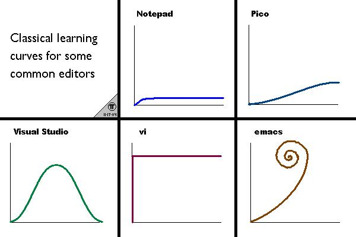

# 软件控

从刚接触电脑开始，我就比较喜欢捣鼓各种软件，一个个的安装，使用，卸载！至今我也记不清自己用过多少软件了。所幸我捣鼓的是软件，没捣鼓单反什么的！不过时间倒是花费了不少，当时桌面软件还是主流，各种软件评论横飞，在安装软件前，我都会花时间先看看评论，再安装试用，本意是想节约点安装卸载时间，后来发现，网上的评论其实对自己的帮助并不大。因为最后我选择的软件都是些“非主流”软件！

工作后，需要一些专业性的软件，我又花了很长时间去试用各种软件！最终，又再一次，我用了不少“非主流”软件。

我花这么多时间在工具上，是因为我相信，**正确的使用好工具**,可以极大的提高效率。无奈好的软件太少，垃圾软件太多！

# 选择工具的标准

在选择工具的同时，我也总结了个人选择工具的标准！

- 足够简单
- 不限制思考
- 跨平台[全平台]
- 颜值

## 足够简单

我说的简单是在操作上的简易性和符合直觉，也就是说，我在拿到软件后，不需要任何的使用说明，靠猜就能入门！如果一上手就让人摸不着头脑，我基本会放弃！比较极端的例子就是Vim：一个没用过Vim的人，第一次用，是完全不知道怎么用的！我现在用Vim的原因就是，Linux默认安装vi！

## 不限制思考

我现在从事的是互联网行业，在前面《人件》的书评中已经提过了，是个“非高科技脑力劳动者”！所以工具需要能帮助思考，而不是限制思考！

## 跨平台/全平台

这个不用说了，现在谁没多个电子设备！为了方便的在多个设备上切换，需要软件能跨平台，最好是全平台！

## 颜值

好吧，我是个颜控！毕竟以后要一直看的，当然越好看越好，你总不会选个董明珠壁纸吧～

# 艰难软件选择路

这里我列出在工作中所需要的软件，以及我的选择和原因！

## IDE

上面已经说了，我是互联网行业，需要Coding!首当其冲需要个称手的“兵器”！我主力开发语言是Java,Java IDE就这么几种:

- eclipse
- Netbeans
- Intellij IDEA

一开始学Java，随大流的用了eclipse，因为各种教材都是基于eclipse的，即使是现在很多的教材都还是在使用eclipse!当时还是07年左右，eclipse是3吧！各种莫名其妙的crash!严重的影响我的Coding心情！于是决定选择替代品！就有了Neteans和Intellij IDEA，其实我还用过JBuilder,JCreator等软件，不过用得不多，因为我已经找到了我要的工具：Intellij IDEA!

先使用的是Netbeans，毕竟是官方出品！第一印象就是界面比较搓！打开文件时，中文无法显示，网上说需要添加参数！而且字体显示太垃圾了(后来好了)，简直就是毁眼睛！

然后用了Intellij IDEA，好像是IDEA7，一开始也挺难用的，我基本花了一个星期才入门！从这一点看，它其实并不太符合我选择软件的标准！不过用它写代码，实在是太TM爽了！各种智能提示：你想什么，它就给你什么！这才是一个工具该做的事情，帮你实现你的想法！自此，我的IDE就一直是IDEA！

## 编辑器

怎么说IDE都太重了，如果只是想写个demo，那么开个IDE就有点大才小用了，或者要记录一些文字什么的，还是使用编辑器方便得多！

相比于IDE,编辑器就是多到眼花缭乱了！

- ULtraEdit
- EditPlus
- Notepad++
- Vim
- Emacs
- SublimeText
- Atom

同样，我最先使用的是ULtraEdit，评论是二进制操作很牛逼！后来发现，自己基本用不上二进制操作，而且启动速度还很慢。就换成了EditPlus,优点就是秒开！再后来就是NotePad++,不过只能在Win下使用，所以也放弃了！

后来就开始纠结Vim和Emacs了，网上的评论一堆一堆的！各有支持者，搞得我也很纠结！后来我两个都用了，现在Vim主要用来编辑服务器配置文件，Emacs已放弃！

现在看来，其实这两个“神器”都不符合我的要求！

- 足够简单：看下Vim和Emacs的学习曲线吧！

- 不限制思考：两个工具都是脑细胞杀手，你得先耗死几亿脑细胞去熟练掌握它们的操作！否则，你在使用它们的时候，思路会不时的被打断：这个操作的快捷键是什么？
- 跨平台[全平台]：这个算合格吧！不过对于Vim来说，GVim和Vim有些快捷键是不一样的，对于一个以全键盘为荣的软件，平台间的命令不同，让使用者情何以堪呢？！
- 颜值：和现代编辑器相比，默认界面完全称不上有颜值！当然得益于其可配置性，可配置出比较炫的界面！不过有些硬伤，是配置无法弥补的！比如：现代编辑器都默认有的目录树，Vim和Emacs都需要使用插件+配置来实现！且是以划分区域的形式实现，感觉非常的怪异！

后来用了SublimeText,不过要收费！对于一个软件开发者，用盗版还是心里过意不去的！

还好有了Atom!虽然启动速度慢了一点，不过使用简单，插件安装方便，且牛逼插件不少！比如TypeScript插件，Golang插件，还有装逼利器，activate-power-mode和atom-miku!由于Atom是基于浏览器的，所以全平台可用！还有Github这个强大的社区支持！没理由不用！唯一的缺点是启动速度慢了点，但是能忍受，还是比IDE快不少的！

## 开发语言

工作中，需要使用Java语言！Java是个合格的工程语言，但是对个人来说并不是个好语言！

很显著的问题就是，它限制了思考！使用Java只能使用面向对象思维来思考,另一方面，Java对面向对象思想的支持其实并不好！例如：现有对象，在不修改代码的情况下，无法方便的添加行为！这就是Java里有那么多的Util类的原因！

我了解的语言不少，不过除了Java，其它语言都可以说只是了解！

- Java
- Kotlin
- Clojure
- Golang
- JavaScript

今年主要关注Golang,因为需要研究Docker!Golang的路径管理挺别扭，需要设置一个Path作为工作路径！如果要在多个路径下进行开发，需要将所有路径都配置到Path里！而个人目前其实最偏向的是Clojure!因为够自由！

## 知识整理

对知识的学习和积累才能成长，所以一个好的知识记录与整理工具很重要！

- Evernote
- 为知笔记
- Xmind
- Markdown
- pandoc
- Atom

第一次使用Evernote还是2的时候吧，就是以瀑布的形式展示文档的！使用Evernote的第一原因是颜值高！不过后来因为下一版布局修改，使用C#开发，安装包由30m左右爆增到100多m。而且网络收藏功能有问题，图片会无故丢失，最后就不用了！后来用了为知笔记，麦库之类的笔记软件。都有这样那样的问题。最后只好使用了组合拳！

- 为知笔记进行收集，前身是网文快捕，专注收集网上资料的
- Xmind整理思路
- Evernote保存Xmind思路，因为有很好的图片搜索功能
- Markdown记录文章
- pandoc做格式转换
- Atom作为编辑器和PDF转换,pandoc的PDF转换费事，且中文支持不好
