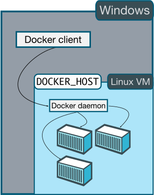
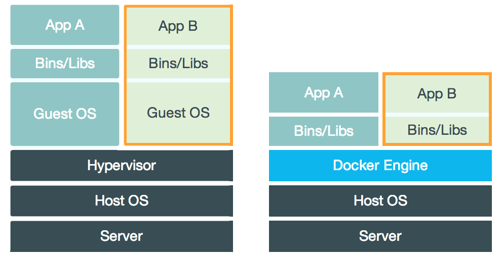

% Docker与服务化
% 王一帆

## 虚拟机

- VMware
- VirtualBox

## 虚拟机的问题

- 速度慢
- 占用资源高

## 容器

## 简介
## Docker架构

## windows

## Linux

## 安装Docker

[官方文档](https://docs.docker.com/engine/installation/linux/ubuntulinux/)

- Ubuntu apt-get
- Windows [Docker Toolbox](https://www.docker.com/toolbox)

## 系统要求

- kernel >= 3.10
- 64位操作系统

## Docker操作
## 服务化

## 待整理

## cgroups
cgroups的一个设计目标是为不同的应用情况提供统一的接口，从控制单一进程(像nice)到操作系统层虚拟化(像opeNVZ，Linux-VServer，LXC)。cgroups提供：

资源限制：组可以被设置不超过设定的内存限制；这也包括虚拟内存。[3] 原来的分页机制是在Linux研讨会的Containers: Challenges with the memory resource controller and its performance报告中提出的。[4]
优先化：一些组可能会得到大量的CPU[5] 或磁盘输入输出通量。[6]
报告：用来衡量系统确实把多少资源用到适合的目的上。[7]
分离：为组分离命名空间，这样一个组不会看到另一个组的进程、网络连接和文件。[2]
控制：冻结组或检查点和重启动。[7]

Image: a package with filesystem and data
Container: a running image
Repository: place where images are hosted/shared
Registry: locally available images
