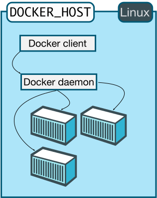

% Docker与服务化
% 王一帆

## 虚拟机

- VMware
- VirtualBox

## 虚拟机的问题

- 速度慢
- 占用资源高
- 发布流程繁琐

## 容器一

- 1979年 — chroot
- 2000年 — FreeBSD Jails
- 2001年 — Linux VServer
- 2004年 — Solaris容器
- 2005年 — OpenVZ
- 2006年 — Process容器
- 2007年 — Control Groups

## 容器二

- 2008年 — LXC
- 2011年 — Warden
- 2013年 — LMCTFY
- 2013年 — Docker
- 2014年 — Rocket
- 2016年 — Windows容器

## 虚拟机与容器


## 性能对比

|特性	|容器	|虚拟机|
|----|----|----|
|启动	|秒级|分钟级|
|磁盘容量|	一般为 MB|	一般为 GB|
|效能	|接近原生|	比较慢|
|系统支持量	|单机上千个容器	|一般几十个|

## 容器的工作

- 文件系统隔离
- 进程隔离
- 网络隔离
- 资源隔离和分组

## Docker是如何做的?

- libcontainer/lxc
- namespace
- cgroups
- 写时复制
- 日志
- 交互式shell

## Why Docker?

<!-- todo -->

## Docker的历史

Docker项目始于2013年3月，由当时的PaaS服务提供商dotCloud开发，dotClound也是YCombinator S10的毕业生。

2013年10月dotCloud公司名字也由dotCloud, Inc.改为Docker, Inc.，集中更多的精力放到了Docker相关的研发上。

## Docker能做什么?

- 加速本地开发和构建流程，使其更加高效、更加轻量化
- 使独立服务或应用程序在不同的环境中，得到相同的运行结果
- 使用Docker创建隔离的环境来进行测试
- Docker可以让开发者先在本机上构建一个复杂的程序或- 架构来进行测试，而不是一开始就在生产环境部署、测试
- 构建一个多用户的平台即服务(Paas)基础设施
- 为开发、测试提供一个轻量级的独立沙盒环境、或者将独立的沙盒环境用于技术教学
- 提供软件即服务(SaaS)应用程序
- 高性能、超大规模的宿主机部署
- 解决了“在我机器上/内网/本地是好的呀！”

## Docker架构


## Docker组件

- Client
- Daemon
- Image: a read-only template
- Container: a running image
- Registry: place where images are hosted/shared---Docker Hub

## Linux



## windows


## 安装Docker

[官方文档](https://docs.docker.com/engine/installation/linux/ubuntulinux/)

- Ubuntu apt-get
- Windows [Docker Toolbox](https://www.docker.com/toolbox)

## 系统要求

- kernel >= 3.10
- 64位操作系统
- 内核必须支持一种适合的存储驱动
- 内核必须支持开启cgroup和namespace功能

## 启动/停止Docker

```sh
sudo start docker
sudo stop docker
```

## Docker Info

```sh
sudo docker info
```

##

```
Containers: 2
Images: 22
Server Version: 1.9.1
Storage Driver: aufs
 Root Dir: /var/lib/docker/aufs
 Backing Filesystem: extfs
 Dirs: 26
 Dirperm1 Supported: false
Execution Driver: native-0.2
Logging Driver: json-file
Kernel Version: 3.13.0-24-generic
Operating System: Ubuntu 14.04.1 LTS
CPUs: 4
Total Memory: 5.693 GiB
```

## 运行第一个容器

```sh
sudo docker run -i -t ubuntu /bin/bash
```


## 做了什么?

https://docs.docker.com/engine/understanding-docker/

## Image


## 查看容器

```
sudo docker ps
```
```
sudo docker ps -a
```


## 安装软件

```
apt-get install vim
```

## 停止容器

```
exit
```

## 重启容器

```
sudo docker start 5fb7ae2e9ed4
```
```
sudo docker start grave_archimedes
```

## 连接到容器

```
sudo docker attach grave_archimedes
```

## 创建镜像

```
sudo docker commit 5fb7ae2e9ed4 repo/imageName
```

## Dockerfile

```
FROM ubuntu:14.04
MAINTAINER wangyifan "wangyifan@made-in-china.com"
RUN apt-get install -y vim
```
```
sudo docker build -t="repo/myimage:v1" .
```

## 做了什么

<!-- todo -->

## Dockerfile指令

- CMD:指定容器启动时要运行的命令
- ENTRYPOINT:与CMD类似，启动时不会被docker run覆盖
- WORKDIR:设置容器内部的工作目录
- ENV:镜像构建过程中设置环境变量
- USER:镜像会以什么样的用户去运行
- VOLUME:向容器添加卷
- ADD:将构建环境下的文件和目录复制到镜像中
- COPY:与ADD类似，只关心在构建上下文中复制本地文件
- ONBUILD:为镜像添加触发器

## 应用

- 构建一个JavaWeb环境

## 方案一

```
FROM ubuntu
MAINTAINER wangyifan <wangyifan@ivaneye.com>
ENV REFRESHED_AT 2014-06-01

RUN apt-get -yqq update
RUN apt-get -yqq install tomcat7 default-jdk

ENV CATALINA_HOME /usr/share/tomcat7
ENV CATALINA_BASE /var/lib/tomcat7
ENV CATALINA_PID /var/run/tomcat7.pid
ENV CATALINA_SH /usr/share/tomcat7/bin/catalina.sh
ENV CATALINA_TMPDIR /tmp/tomcat7-tomcat7-tmp

RUN mkdir -p $CATALINA_TMPDIR

VOLUME ["/var/lib/tomcat7/webapps/"]

EXPOSE 8080

ENTRYPOINT ["/usr/share/tomcat7/bin/catalina.sh","run"]
```

## 方案二

<!-- 数据卷 -->

## Docker与Hydra

- Docker作为Hydra的环境
- Docker作为Hydra的容器
