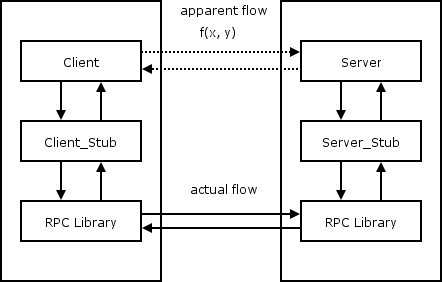
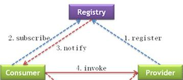

% Hydra3架构
% 王一帆

## RPC

## 多个客户端，多个服务端

RPC演进为服务的过程

## 服务

##

##

## Hydra2技术栈

- Netty(Pigeon)
- OSGi

## Hydra2问题

- 增加开发及部署难度
- 运行时错误提示
- 发布服务不方便
- 无服务治理

## Hydra3技术选型

- OSGi(屏蔽OSGi可见性)
- 自定义ClassLoader

## 运行时与多版本

## 如何解决反序列化问题?

## Netty4架构

##

