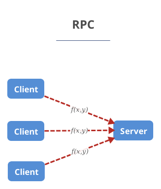
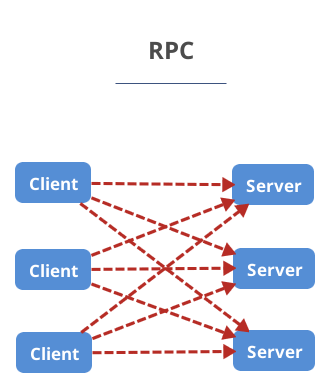
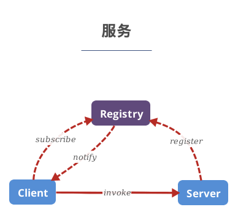
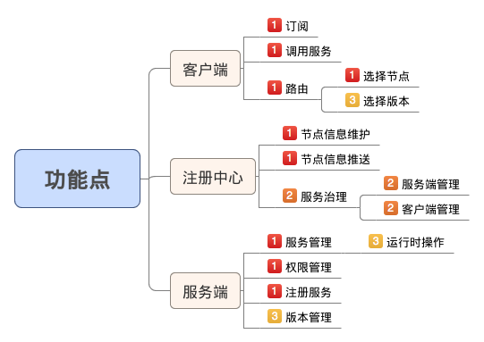
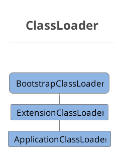
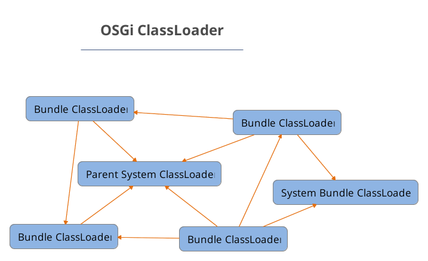
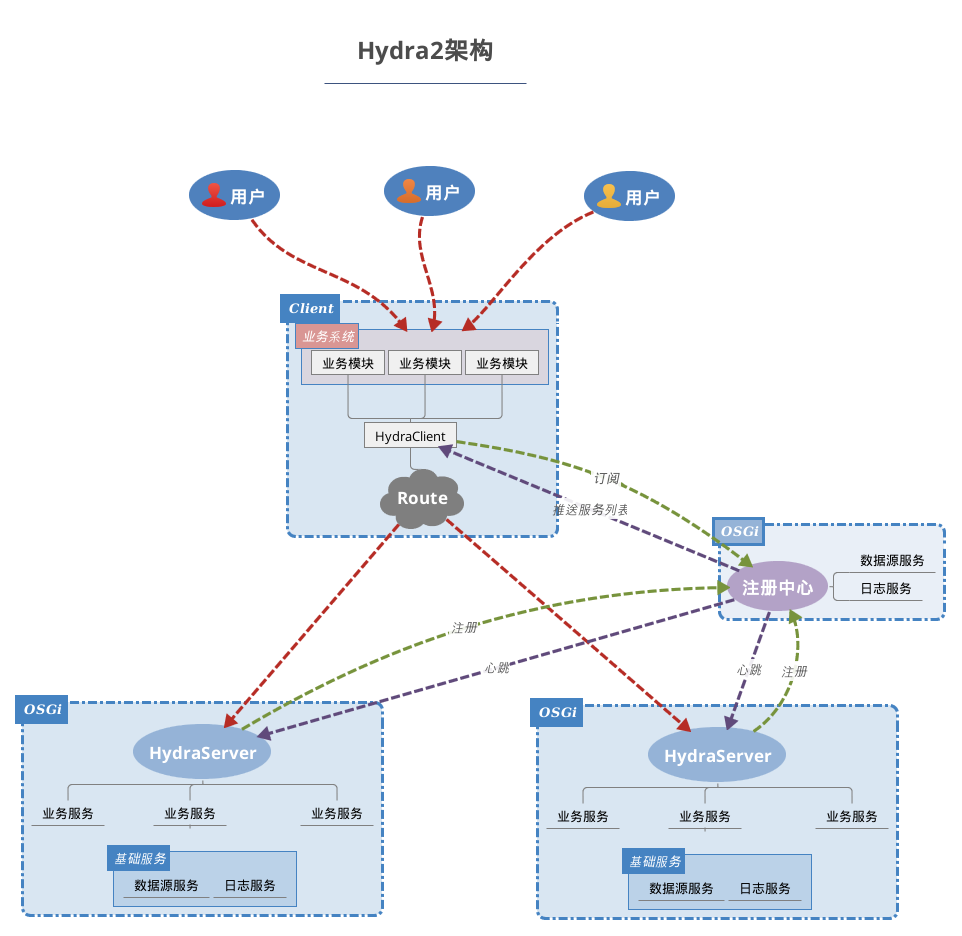
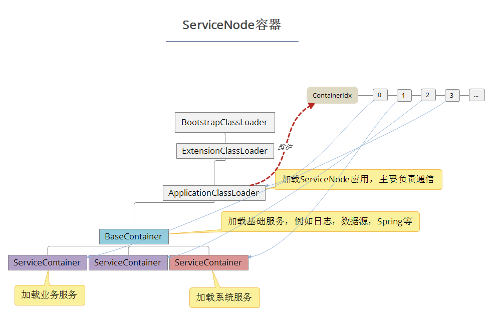
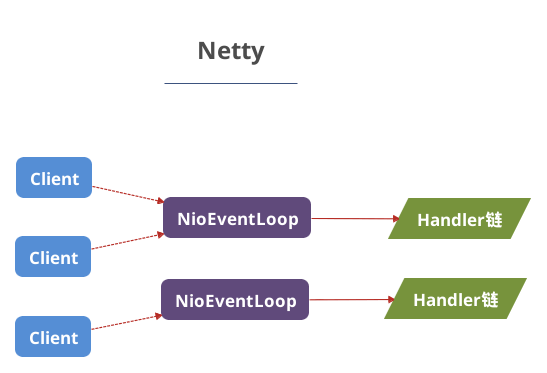
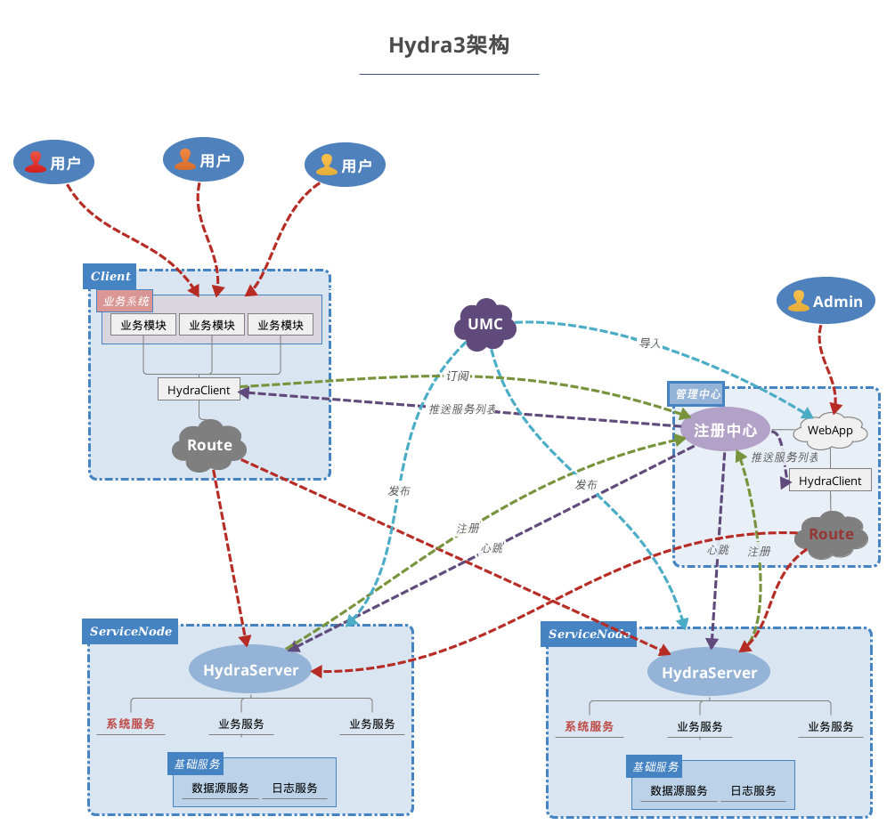

% Hydra3架构
% 王一帆

## RPC

. . .

##

. . .

- Client需要知道Server地址

##

##

##

##

## Hydra2技术栈

- Netty(Pigeon)
- OSGi

## ClassLoader

## OSGi ClassLoader

##

## Hydra2的缺陷

- 增加开发及部署难度
- 运行时错误提示
- 发布服务不方便
- 无服务治理

## Hydra3技术选型

- OSGi(屏蔽OSGi可见性)
- 自定义ClassLoader

##

## Netty4架构

##

# 谢谢
