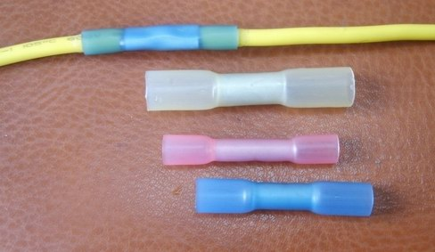
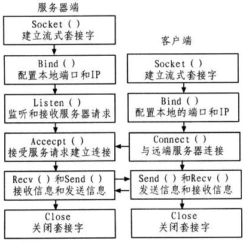

% IO模型
% 王一帆

## 目录

- 客户端-服务端模型
- BIO模型
- NIO模型
- Reactor模型
- Netty模型
- Pigeon模型

## 客户端-服务端模型

### 什么是服务？
### Socket(套接字)




### 阻塞IO/非阻塞IO
### 同步IO/异步IO

## BIO模型

### 客户端代码

```java
Socket client = new Socket("127.0.0.1",7777);    
PrintWriter pw = new PrintWriter(client.getOutputStream());  
BufferedReader br=new BufferedReader(new InputStreamReader(System.in));  
pw.write(br.readLine());  
pw.close();  
br.close();
```

### 服务端代码

```java
Socket socket;  
ServerSocket ss = new ServerSocket(7777);  
while (true) {  
    socket = ss.accept();  
    BufferedReader br = new BufferedReader(new InputStreamReader(socket  
                    .getInputStream()));  
    System.out.println("you input is : " + br.readLine());  
}
```

### 图示

### 优缺点


## NIO模型

### 客户端代码(连接)

```java
//获取socket通道
SocketChannel channel = SocketChannel.open();        
channel.configureBlocking(false);
//获得通道管理器
selector=Selector.open();        
channel.connect(new InetSocketAddress(serverIp, port));
//为该通道注册SelectionKey.OP_CONNECT事件
channel.register(selector, SelectionKey.OP_CONNECT);
```

### 客户端代码(监听)

```java
while(true){
   selector.select();//选择注册过的io操作的事件(第一次为SelectionKey.OP_CONNECT)
   while(SelectionKey key : selector.selectedKeys()){
       if(key.isConnectable()){
           SocketChannel channel=(SocketChannel)key.channel();
           if(channel.isConnectionPending()){
               channel.finishConnect();//如果正在连接，则完成连接
           }
           channel.register(selector, SelectionKey.OP_READ);
       }else if(key.isReadable()){ //有可读数据事件。
           SocketChannel channel = (SocketChannel)key.channel();
           ByteBuffer buffer = ByteBuffer.allocate(10);
           channel.read(buffer);
           byte[] data = buffer.array();
           String message = new String(data);
           System.out.println("recevie message from server:, size:" + buffer.position() + " msg: " + message);
       }
   }
}
```

### 服务端代码(连接)

```java
//获取一个ServerSocket通道
ServerSocketChannel serverChannel = ServerSocketChannel.open();
serverChannel.configureBlocking(false);
serverChannel.socket().bind(new InetSocketAddress(port));
//获取通道管理器
selector = Selector.open();
//将通道管理器与通道绑定，并为该通道注册SelectionKey.OP_ACCEPT事件，
serverChannel.register(selector, SelectionKey.OP_ACCEPT);
```

### 服务端代码(监听)

```java
while(true){
   selector.select();//当有注册的事件到达时，方法返回，否则阻塞。
   for(SelectionKey key : selector.selectedKeys()){
       if(key.isAcceptable()){
           ServerSocketChannel server = (ServerSocketChannel)key.channel();
           SocketChannel channel = server.accept();
           channel.write(ByteBuffer.wrap(new String("send message to client").getBytes()));
           //在与客户端连接成功后，为客户端通道注册SelectionKey.OP_READ事件。
           channel.register(selector, SelectionKey.OP_READ);
       }else if(key.isReadable()){//有可读数据事件
           SocketChannel channel = (SocketChannel)key.channel();
           ByteBuffer buffer = ByteBuffer.allocate(10);
           int read = channel.read(buffer);
           byte[] data = buffer.array();
           String message = new String(data);
           System.out.println("receive message from client, size:" + buffer.position() + " msg: " + message);
       }
   }
}
```

### 图示

### 优缺点

### poll/select/epoll

### 拆包/粘包(半包问题)

## Reactor模型

- 为什么需要Reactor模型
- Reactor中的组件
- Reactor模型分类

## Reactor中的组件

- Reactor:Reactor是IO事件的派发者。
- Acceptor:Acceptor接受client连接，建立对应client的Handler，并向Reactor注册此Handler。
- Handler:和一个client通讯的实体，按这样的过程实现业务的处理。一般在基本的Handler基础上还会有更进一步的层次划分， 用来抽象诸如decode，process和encoder这些过程。比如对Web Server而言，decode通常是HTTP请求的解析， process的过程会进一步涉及到Listner和Servlet的调用。业务逻辑的处理在Reactor模式里被分散的IO事件所打破， 所以Handler需要有适当的机制在所需的信息还不全（读到一半）的时候保存上下文，并在下一次IO事件到来的 时候（另一半可读了）能继续中断的处理。为了简化设计，Handler通常被设计成状态机，按GoF的state pattern来 实现。

## Netty模型

- 什么是Netty
- Netty架构实现
- Netty解决半包/粘包

## Pigeon模型

- Pigeon的目标
- Pigeon的实现
- RingBuffer
- 后续规划

## 参考资料

[Reactor论文](http://www.dre.vanderbilt.edu/~schmidt/PDF/reactor-siemens.pdf)
[Doug Lea《Scalable IO in Java》](http://gee.cs.oswego.edu/dl/cpjslides/nio.pdf)
[Netty源码](https://github.com/netty/netty)
[剖析Disruptor:为什么会这么快？](http://mechanitis.blogspot.com/2011/07/dissecting-disruptor-why-its-so-fast.html)
[剖析Disruptor:为什么会这么快？(中文)](http://ifeve.com/locks-are-bad/)
[Java SE1.6中的Synchronized](http://ifeve.com/java-synchronized/)
[线程安全的无锁RingBuffer实现](http://www.cnblogs.com/l00l/p/4115001.html)
[Java NIO类库Selector机制解析（上）](http://blog.csdn.net/haoel/article/details/2224055)
[Java NIO类库Selector机制解析（下）](http://blog.csdn.net/haoel/article/details/2224069)

# 谢谢
