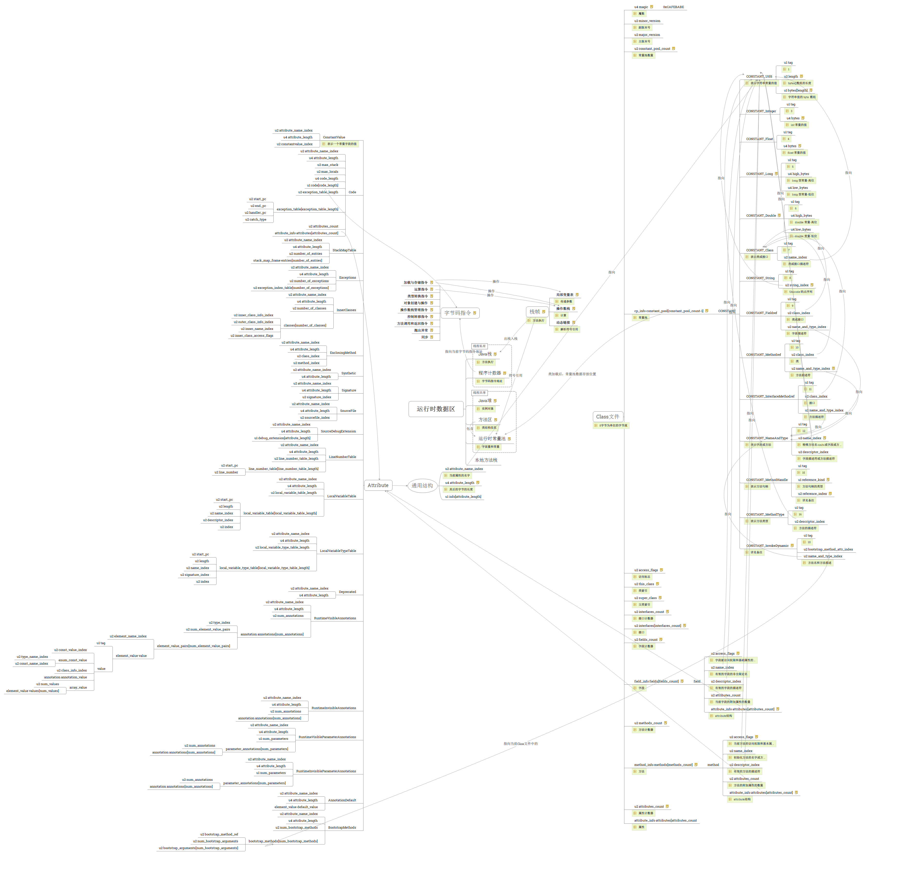

% Java的JVM表示
% 王一帆

## 目录

- JVM印象
- Java的ClassFile表示
- ClassFile的JVM表示
- JVM运行流程
	- Loading
	- Linking
		- Verification
		- Preparation
		- Resolution
	- Initailizing
- 示例

# JVM印象

## 一次编译，到处运行


## 传值还是传引用？

```java
public class Change {
	public void change(int i){
		i = 2;
	}
	
	public void change(String str){
		str = "Hi";
	}
		
	public void change(StringBuffer str){
		str.append("Hi");
	}
    
    public static void main(String[] args){
        Change change = new Change();
        int i = 1;
        String str = "Hello";
        StringBuffer sb = new StringBuffer("Hello");
        change.change(i);
        change.change(str);
        change.change(sb);
    }
}
```

## 


## 字符串比较

```
public class Test{
    public static void main(String[] args){
        String s1 = "hello";
        String s2 = "hello";
        String s3 = "he" + "llo";
        String s4 = new String("hello");
        String s5 = new String(s1);
        System.out.println(s1 == s2);
        System.out.println(s1 == s3);
        System.out.println(s1 == s4);
        System.out.println(s1 == s5);
        System.out.println(s5 == s4);
        System.out.println(s1.equals(s4));
        System.out.println(s3.equals(s4));
    }
}
```

## 初始化顺序

```
public class Circle {

    int radius = prt("初始化radius");
    int t = prt("初始化t");
    static int s = prt("初始化s");

    {System.out.println("初始化块");}

    static{
        System.out.println("静态初始化块");
    }

    public Circle(){
        System.out.println("默认构造方法");
    }

    public static int prt(String text){
        System.out.println(text);
        return 0;
    }

    public static void main(String[] args){
        Circle circle = new Circle();
        Circle circle2 = new Circle();
    }
}
```

## GC 

- YoungGC
- FullGC
- Eden Space
- Survivor Space
- Old Space
- PermGen Space

## JVM


## 书单

- [The Java Language Specification, Java SE 8 Edition](https://docs.oracle.com/javase/specs/jls/se8/jls8.pdf)
- [The Java Virtual Machine Specification, Java SE 8 Edition](https://docs.oracle.com/javase/specs/jvms/se8/jvms8.pdf)
- [Inside the Java 2 Virtual Machine](http://www.artima.com/insidejvm/ed2/index.html)
- [深入理解Java虚拟机-JVM高级特性与最佳实践](https://book.douban.com/subject/6522893/)
- [自己动手写Java虚拟机](https://book.douban.com/subject/26802084/)
- [Java性能优化权威指南](https://book.douban.com/subject/25828043/)
- [HotSpot实战](https://book.douban.com/subject/25847620/)

## 例子

```java
public class Person {
    public String sayHi(){
        return "Hi";
    }
}

public class Main {
    public static void main(String[] args){
        Person person = new Person();
        String hi = person.sayHi();
        System.out.println(hi);
    }
}
```

# Java的ClassFile表示

## ClassFile结构

```
ClassFile {
    u4 magic;
    u2 minor_version;
    u2 major_version;
    u2 constant_pool_count;
    cp_info constant_pool[constant_pool_count-1];
    u2 access_flags;
    u2 this_class;
    u2 super_class;
    u2 interfaces_count;
    u2 interfaces[interfaces_count];
    u2 fields_count;
    field_info fields[fields_count];
    u2 methods_count;
    method_info methods[methods_count];
    u2 attributes_count;
    attribute_info attributes[attributes_count];
}
```

## 反编译

```
javap -verbose Person
```
```
public class Person
  minor version: 0
  major version: 52
  flags: ACC_PUBLIC, ACC_SUPER
Constant pool:
   #1 = Methodref          #4.#13         // java/lang/Object."<init>":()V
   #2 = String             #14            // Hi
   #3 = Class              #15            // Person
   #4 = Class              #16            // java/lang/Object
   #5 = Utf8               <init>
   #6 = Utf8               ()V
   #7 = Utf8               Code
   #8 = Utf8               LineNumberTable
   #9 = Utf8               sayHi
  #10 = Utf8               ()Ljava/lang/String;
  #11 = Utf8               SourceFile
  #12 = Utf8               Person.java
  #13 = NameAndType        #5:#6          // "<init>":()V
  #14 = Utf8               Hi
  #15 = Utf8               Person
  #16 = Utf8               java/lang/Object
{
  public Person();
    descriptor: ()V
    flags: ACC_PUBLIC
    Code:
      stack=1, locals=1, args_size=1
         0: aload_0
         1: invokespecial #1                  // Method java/lang/Object."<init>"
:()V
         4: return
      LineNumberTable:
        line 1: 0

  public java.lang.String sayHi();
    descriptor: ()Ljava/lang/String;
    flags: ACC_PUBLIC
    Code:
      stack=1, locals=1, args_size=1
         0: ldc           #2                  // String Hi
         2: areturn
      LineNumberTable:
        line 4: 0
}
```

## 运行

```
java Main
```

# ClassFile的JVM表示

讲解JVM结构以及ClassFile与JVM中的对应关系

方法区（method area）只是JVM规范中定义的一个概念，用于存储类信息、常量池、静态变量、JIT编译后的代码等数据，具体放在哪里，不同的实现可以放在不同的地方。而永久代是Hotspot虚拟机特有的概念，是方法区的一种实现，别的JVM都没有这个东西。

在Java 6中，方法区中包含的数据，除了JIT编译生成的代码存放在native memory的CodeCache区域，其他都存放在永久代；
在Java 7中，Symbol的存储从PermGen移动到了native memory，并且把静态变量从instanceKlass末尾（位于PermGen内）移动到了java.lang.Class对象的末尾（位于普通Java heap内）；
在Java 8中，永久代被彻底移除，取而代之的是另一块与堆不相连的本地内存——元空间（Metaspace）,‑XX:MaxPermSize 参数失去了意义，取而代之的是-XX:MaxMetaspaceSize。

# JVM运行流程

从Java ClassName开始，JVM如何启动，执行，并退出的

# 示例

通过示例，演示上面的流程

# 整理结构图



## 开源代码

- [HotSpot](http://openjdk.java.net/groups/hotspot/)  [Java:116w C:19.6w+4.5w C++:2w ]
- [自己动手写Java虚拟机源代码](https://github.com/zxh0/jvmgo-book)   [Go:9k]
- [JamVM](https://sourceforge.net/projects/jamvm/?source=typ_redirect) [C:1.5w+9k]
- [JikesRVM](http://www.jikesrvm.org/) [Java:14w ]

# 谢谢
