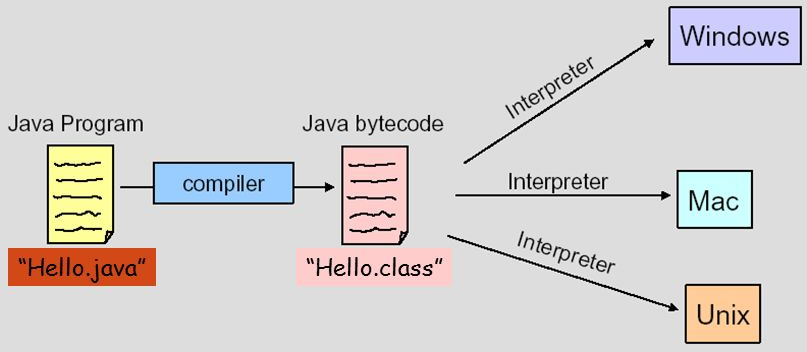
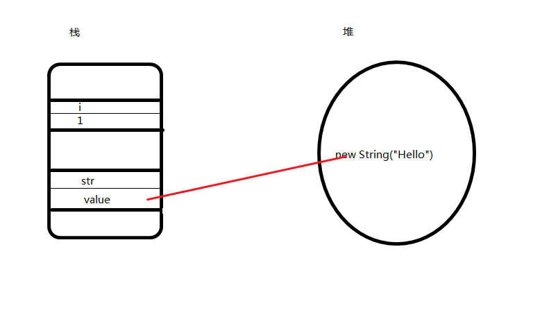
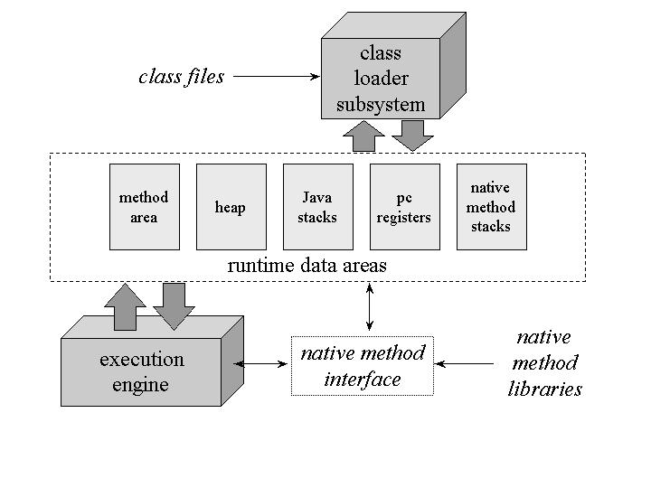

% Java的JVM表示
% 王一帆

## 目录

- JVM印象
- Java的ClassFile表示
- ClassFile的JVM表示
- JVM运行流程
	- Loading
	- Linking
		- Verification
		- Preparation
		- Resolution
	- Initailizing
- 示例

# JVM印象

## 一次编译，到处运行



## 传值还是传引用？

```java
public class Change {
	public void change(int i){
		i = 2;
	}
	
	public void change(String str){
		str = "Hi";
	}
		
	public void change(StringBuffer str){
		str.append("Hi");
	}
    
    public static void main(String[] args){
        Change change = new Change();
        int i = 1;
        String str = "Hello";
        StringBuffer sb = new StringBuffer("Hello");
        change.change(i);
        change.change(str);
        change.change(sb);
    }
}
```

## 



## 字符串比较

```
public class Test{
    public static void main(String[] args){
        String s1 = "hello";
        String s2 = "hello";
        String s3 = "he" + "llo";
        String s4 = new String("hello");
        String s5 = new String(s1);
        System.out.println(s1 == s2);
        System.out.println(s1 == s3);
        System.out.println(s1 == s4);
        System.out.println(s1 == s5);
        System.out.println(s5 == s4);
        System.out.println(s1.equals(s4));
        System.out.println(s3.equals(s4));
    }
}
```

## 初始化顺序

```
public class Circle {

    int radius = prt("初始化radius");
    int t = prt("初始化t");
    static int s = prt("初始化s");

    {System.out.println("初始化块");}

    static{
        System.out.println("静态初始化块");
    }

    public Circle(){
        System.out.println("默认构造方法");
    }

    public static int prt(String text){
        System.out.println(text);
        return 0;
    }

    public static void main(String[] args){
        Circle circle = new Circle();
        Circle circle2 = new Circle();
    }
}
```

## GC 

- YoungGC
- FullGC
- Eden Space
- Survivor Space
- Old Space
- PermGen Space

## JVM



# Java的ClassFile表示

讲解ClassFile结构

# ClassFile的JVM表示

讲解JVM结构以及ClassFile与JVM中的对应关系

方法区（method area）只是JVM规范中定义的一个概念，用于存储类信息、常量池、静态变量、JIT编译后的代码等数据，具体放在哪里，不同的实现可以放在不同的地方。而永久代是Hotspot虚拟机特有的概念，是方法区的一种实现，别的JVM都没有这个东西。

在Java 6中，方法区中包含的数据，除了JIT编译生成的代码存放在native memory的CodeCache区域，其他都存放在永久代；
在Java 7中，Symbol的存储从PermGen移动到了native memory，并且把静态变量从instanceKlass末尾（位于PermGen内）移动到了java.lang.Class对象的末尾（位于普通Java heap内）；
在Java 8中，永久代被彻底移除，取而代之的是另一块与堆不相连的本地内存——元空间（Metaspace）,‑XX:MaxPermSize 参数失去了意义，取而代之的是-XX:MaxMetaspaceSize。

# JVM运行流程

从java ClassName开始，JVM如何启动，执行，并退出的

# 示例

通过示例，演示上面的流程

## 参考资料

- [The Java Language Specification, Java SE 8 Edition](https://docs.oracle.com/javase/specs/jls/se8/jls8.pdf)
- [The Java Virtual Machine Specification, Java SE 8 Edition](https://docs.oracle.com/javase/specs/jvms/se8/jvms8.pdf)
- [Inside the Java 2 Virtual Machine](http://www.artima.com/insidejvm/ed2/index.html)
- [深入理解Java虚拟机-JVM高级特性与最佳实践](https://book.douban.com/subject/6522893/)
- [自己动手写Java虚拟机](https://book.douban.com/subject/26802084/)

# 谢谢
