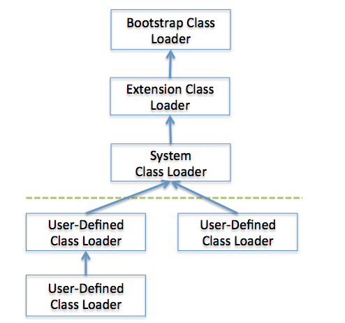

% Java的JVM表示
% 王一帆

## JVM印象

## 一次编译，到处运行


## 传值还是传引用？

```java
public class Change {
	public void change(int i){
		i = 2;
	}
	
	public void change(String str){
		str = "Hi";
	}
		
	public void change(StringBuffer str){
		str.append("Hi");
	}
    
    public static void main(String[] args){
        Change change = new Change();
        int i = 1;
        String str = "Hello";
        StringBuffer sb = new StringBuffer("Hello");
        change.change(i);
        change.change(str);
        change.change(sb);
    }
}
```

## 


## 字符串比较

```java
public class Test{
    public static void main(String[] args){
        String s1 = "hello";
        String s2 = "hello";
        String s3 = "he" + "llo";
        String s4 = new String("hello");
        String s5 = new String(s1);
        System.out.println(s1 == s2);
        System.out.println(s1 == s3);
        System.out.println(s1 == s4);
        System.out.println(s1 == s5);
        System.out.println(s5 == s4);
        System.out.println(s1.equals(s4));
        System.out.println(s3.equals(s4));
    }
}
```

## 初始化顺序

```java
public class Circle {

    int radius = prt("初始化radius");
    int t = prt("初始化t");
    static int s = prt("初始化s");

    {System.out.println("初始化块");}

    static{
        System.out.println("静态初始化块");
    }

    public Circle(){
        System.out.println("默认构造方法");
    }

    public static int prt(String text){
        System.out.println(text);
        return 0;
    }

    public static void main(String[] args){
        Circle circle = new Circle();
        Circle circle2 = new Circle();
    }
}
```

## GC 

- YoungGC
- FullGC
- Eden Space
- Survivor Space
- Old Space
- PermGen Space

## JVM


## 书单

- [The Java Language Specification, Java SE 8 Edition](https://docs.oracle.com/javase/specs/jls/se8/jls8.pdf)
- [The Java Virtual Machine Specification, Java SE 8 Edition](https://docs.oracle.com/javase/specs/jvms/se8/jvms8.pdf)
- [Inside the Java 2 Virtual Machine](http://www.artima.com/insidejvm/ed2/index.html)
- [深入理解Java虚拟机-JVM高级特性与最佳实践](https://book.douban.com/subject/6522893/)
- [自己动手写Java虚拟机](https://book.douban.com/subject/26802084/)
- [Java性能优化权威指南](https://book.douban.com/subject/25828043/)
- [HotSpot实战](https://book.douban.com/subject/25847620/)
- [Oracle JRockit: The Definitive Guide](https://www.amazon.com/Oracle-JRockit-The-Definitive-Guide/dp/1847198066/ref=sr_1_1?ie=UTF8&qid=1373331499&sr=8-1&keywords=oracle+jrockit+the+definitive+guide)

## 例子

```java
public class Calc {
    public int sum(){
        int a = 1;
        int b = 2;
        int c = a + b;
        return c;
    }
}

public class Main {
    public static void main(String[] args){
        Calc calc = new Calc();
        int result = calc.sum();
        System.out.println(result);
    }
}
```

## 编译

```
javac Calc.java
```

## ClassFile结构

- jvms8 4.1

```
ClassFile {
    u4 magic;
    u2 minor_version;
    u2 major_version;
    u2 constant_pool_count;
    cp_info constant_pool[constant_pool_count-1];
    u2 access_flags;
    u2 this_class;
    u2 super_class;
    u2 interfaces_count;
    u2 interfaces[interfaces_count];
    u2 fields_count;
    field_info fields[fields_count];
    u2 methods_count;
    method_info methods[methods_count];
    u2 attributes_count;
    attribute_info attributes[attributes_count];
}
```

## 反编译

```
javap -verbose Calc
```

## 

```
public class Calc
  minor version: 0
  major version: 52
  flags: ACC_PUBLIC, ACC_SUPER
Constant pool:
   #1 = Methodref          #3.#12         // java/lang/Object."<init>":()V
   #2 = Class              #13            // Calc
   #3 = Class              #14            // java/lang/Object
   #4 = Utf8               <init>
   #5 = Utf8               ()V
   #6 = Utf8               Code
   #7 = Utf8               LineNumberTable
   #8 = Utf8               sum
   #9 = Utf8               ()I
  #10 = Utf8               SourceFile
  #11 = Utf8               Calc.java
  #12 = NameAndType        #4:#5          // "<init>":()V
  #13 = Utf8               Calc
  #14 = Utf8               java/lang/Object
{
  public Calc();
    descriptor: ()V
    flags: ACC_PUBLIC
    Code:
      stack=1, locals=1, args_size=1
         0: aload_0
         1: invokespecial #1                  // Method java/lang/Object."<init>"
:()V
         4: return
      LineNumberTable:
        line 1: 0

  public int sum();
    descriptor: ()I
    flags: ACC_PUBLIC
    Code:
      stack=2, locals=4, args_size=1
         0: iconst_1
         1: istore_1
         2: iconst_2
         3: istore_2
         4: iload_1
         5: iload_2
         6: iadd
         7: istore_3
         8: iload_3
         9: ireturn
      LineNumberTable:
        line 3: 0
        line 4: 2
        line 5: 4
        line 6: 8
}
```

## 运行

```
java Main
```

## 启动JVM

- jvms8 5.2

The Java Virtual Machine starts up by creating an initial class, which is specified
in an implementation-dependent manner, using the bootstrap class loader (§5.3.1).
The Java Virtual Machine then links the initial class, initializes it, and invokes
the public class method void main(String[]).

## 加载Initial Class

- jvms8 5.3.1 5.3.2
- JVM规范定义了两种类型的类装载器：bootstrap class loader,user-defined class loader



## 加载到哪里？

- 方法区

方法区（method area）只是JVM规范中定义的一个概念，用于存储类信息、常量池、静态变量、JIT编译后的代码等数据，具体放在哪里，不同的实现可以放在不同的地方。而永久代是Hotspot虚拟机特有的概念，是方法区的一种实现，别的JVM都没有这个东西。

在Java 6中，方法区中包含的数据，除了JIT编译生成的代码存放在native memory的CodeCache区域，其他都存放在永久代；
在Java 7中，Symbol的存储从PermGen移动到了native memory，并且把静态变量从instanceKlass末尾（位于PermGen内）移动到了java.lang.Class对象的末尾（位于普通Java heap内）；
在Java 8中，永久代被彻底移除，取而代之的是另一块与堆不相连的本地内存——元空间（Metaspace）,‑XX:MaxPermSize 参数失去了意义，取而代之的是-XX:MaxMetaspaceSize。

## 链接

- Verification
- Preparation
- Resolution

## Verification

- jvms8 5.4.1

Verification (§4.10) ensures that the binary representation of a class or interface is
structurally correct (§4.9). Verification may cause additional classes and interfaces
to be loaded (§5.3) but need not cause them to be verified or prepared.

## Preparation

- jvms8 5.4.2

Preparation involves creating the static fields for a class or interface and initializing
such fields to their default values (§2.3, §2.4). This does not require the execution
of any Java Virtual Machine code; explicit initializers for static fields are executed
as part of initialization (§5.5), not preparation.

## Resolution

- jvms8 5.4.3

The Java Virtual Machine instructions anewarray, checkcast, getfield,
getstatic, instanceof, invokedynamic, invokeinterface, invokespecial, invokestatic,
invokevirtual, ldc, ldc_w, multianewarray, new, putfield, and putstatic make
symbolic references to the run-time constant pool. Execution of any of these
instructions requires resolution of its symbolic reference.

## 初始化

- jvms8 5.5

Initialization of a class or interface consists of executing its class or interface
initialization method

## 执行main

- 栈帧(Frame) jvms8 2.6
    - 局部变量表(Local Variables) jvms8 2.6.1
    - 操作数栈(Operand Stacks)  jvms8 2.6.2
    - 动态链接(Dynamic Linking) jvms8 2.6.3

## 

```
public class Main
Constant pool:
   #1 = Methodref          #8.#17         // java/lang/Object."<init>":()V
   #2 = Class              #18            // Calc
   #3 = Methodref          #2.#17         // Calc."<init>":()V
   #4 = Methodref          #2.#19         // Calc.sum:()I
   #5 = Fieldref           #20.#21        // java/lang/System.out:Ljava/io/PrintStream;
   #6 = Methodref          #22.#23        // java/io/PrintStream.println:(I)V
   #7 = Class              #24            // Main
   #8 = Class              #25            // java/lang/Object
   #9 = Utf8               <init>
  #10 = Utf8               ()V
  #11 = Utf8               Code
  #12 = Utf8               LineNumberTable
  #13 = Utf8               main
  #14 = Utf8               ([Ljava/lang/String;)V
  #15 = Utf8               SourceFile
  #16 = Utf8               Main.java
  #17 = NameAndType        #9:#10         // "<init>":()V
  #18 = Utf8               Calc
  #19 = NameAndType        #26:#27        // sum:()I
  #20 = Class              #28            // java/lang/System
  #21 = NameAndType        #29:#30        // out:Ljava/io/PrintStream;
  #22 = Class              #31            // java/io/PrintStream
  #23 = NameAndType        #32:#33        // println:(I)V
  #24 = Utf8               Main
  #25 = Utf8               java/lang/Object
  #26 = Utf8               sum
  #27 = Utf8               ()I
  #28 = Utf8               java/lang/System
  #29 = Utf8               out
  #30 = Utf8               Ljava/io/PrintStream;
  #31 = Utf8               java/io/PrintStream
  #32 = Utf8               println
  #33 = Utf8               (I)V
{
  public static void main(java.lang.String[]);
    descriptor: ([Ljava/lang/String;)V
    flags: ACC_PUBLIC, ACC_STATIC
    Code:
      stack=2, locals=3, args_size=1
         0: new           #2                  // class Calc
         3: dup
         4: invokespecial #3                  // Method Calc."<init>":()V
         7: astore_1
         8: aload_1
         9: invokevirtual #4                  // Method Calc.sum:()I
        12: istore_2
        13: getstatic     #5                  // Field java/lang/System.out:Ljava/io/PrintStream;
        16: iload_2
        17: invokevirtual #6                  // Method java/io/PrintStream.println:(I)V
        20: return
}
```

##

```
public class Calc
Constant pool:
   #1 = Methodref          #3.#12         // java/lang/Object."<init>":()V
   #2 = Class              #13            // Calc
   #3 = Class              #14            // java/lang/Object
   #4 = Utf8               <init>
   #5 = Utf8               ()V
   #6 = Utf8               Code
   #7 = Utf8               LineNumberTable
   #8 = Utf8               sum
   #9 = Utf8               ()I
  #10 = Utf8               SourceFile
  #11 = Utf8               Calc.java
  #12 = NameAndType        #4:#5          // "<init>":()V
  #13 = Utf8               Calc
  #14 = Utf8               java/lang/Object
{
  public Calc();
    descriptor: ()V
    flags: ACC_PUBLIC
    Code:
      stack=1, locals=1, args_size=1
         0: aload_0
         1: invokespecial #1                  // Method java/lang/Object."<init>"
:()V
         4: return

  public int sum();
    descriptor: ()I
    flags: ACC_PUBLIC
    Code:
      stack=2, locals=4, args_size=1
         0: iconst_1
         1: istore_1
         2: iconst_2
         3: istore_2
         4: iload_1
         5: iload_2
         6: iadd
         7: istore_3
         8: iload_3
         9: ireturn
}
```

## 


## 开源代码

- [HotSpot](http://openjdk.java.net/groups/hotspot/)  **Java:116w C:19.6w+4.5w C++:2w **
- [自己动手写Java虚拟机源代码](https://github.com/zxh0/jvmgo-book)   **Go:9k**
- [JamVM](https://sourceforge.net/projects/jamvm/?source=typ_redirect) **C:1.5w+9k**
- [JikesRVM](http://www.jikesrvm.org/) **Java:14w**

# 谢谢
