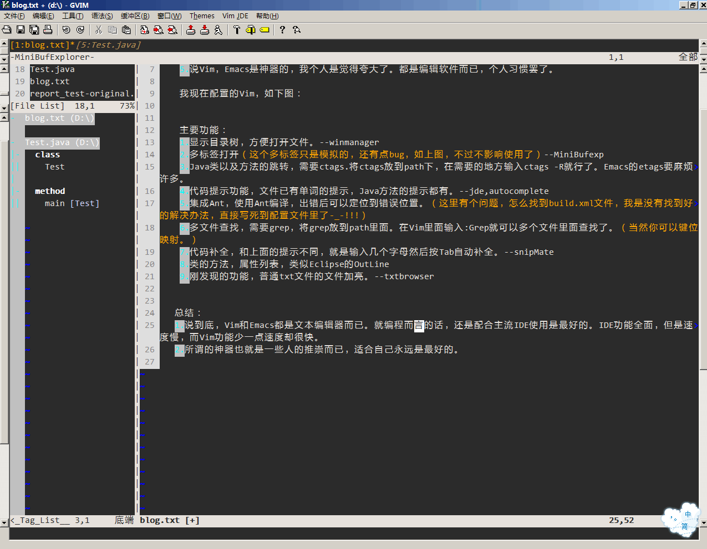
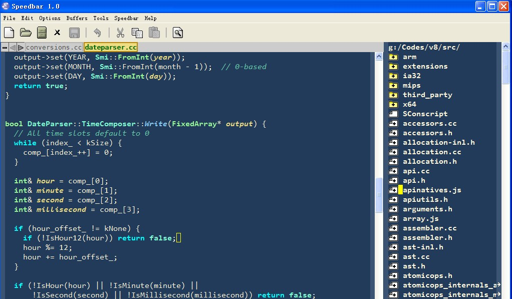
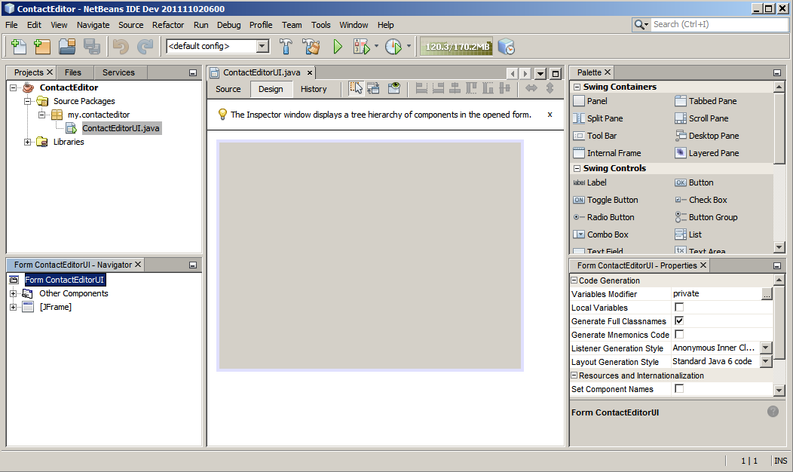
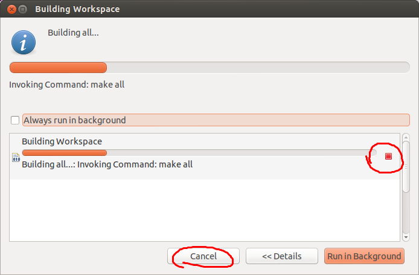

% 工具的体验
% 王一帆
% 2016-05-20

## 选择标准

- 简单
- 跨平台/全平台
- 颜值

##

- 编辑器
- 文档编写
- IDE

## 编辑器

- 文本编辑器
- notepad++
- UltraEdit
- EditPlus
- TextMate

- Vim
- **Emacs**

- SublimeText
- **Atom**

## 编辑器之神与神用的编辑器

. . .


## Vim

- 缺点
    - 原始界面太难看
    - 难度太高
- 优势
    - 操作快速

##



演示：基本操作，列操作，宏

## Emacs

- 缺点
    - 原始界面太难看
    - 手残率高
- 优势
    - 伪装成编辑器的操作系统

##



## Atom

- 缺点
    - 速度慢
- 优势
    - 社区驱动
    - 开箱即用

## 编辑器

- 110 万用户（月度活跃用户）
- 1590 万次下载
- 300 个新版本发布
- 1144 个代码贡献者
- 6.2 万次代码提交
- 5897 个 Pull Request
- 920 万次月访客量

## 社区(插件和主题)

- 4155 个插件
- 1239 个主题
- 3495 个作者
- 24.6 万次代码提交
- 4800 万次安装
- 9.5 万个星标

## Atom插件

- MiniMap
- Markdown
- Script
- Golang
- TypeScript

## 福利

- activate-power-mode
- atom-miku

. . .

- 做工粗糙
- 仅供娱乐
- 没有卵用

## 文档编写

- Office
- plantUML
- Markdown+Pandoc

## Office

- 2/8原则


## graphviz/plantUML

- 所想即所得
- [plantUML](http://zh.plantuml.com/)

## Markdown+Pandoc

- Markdown负责内容
- Pandoc负责渲染

## Markdown三分钟入门

文件名以md结尾

|语法|说明|
|---|---|
|# title|标题，一个#号代表一个级别|
|- text|列表|
|1. text|还是列表|
|\[text\](url)|链接|
|\!\[\](img-url)|图片|
|> text|引用|
|\*斜体\*|*斜体*|
|\*\*粗体\*\*|**粗体**|
|```|代码|

## Markdown扩展语法

- 流程图
- 时序图
- 脑图
- 公式

## Pandoc三十秒入门

```
pandoc source.md -o target.docx
```

## IDE

- NetBeans
- Eclipse
- Intellij IDEA

## NetBeans

- WYSIWYG



## Eclipse

- Crash
- 快捷键
- 配置保存在workspace中
- 保存时编译
- 恶心的进度条



## Intellij IDEA

- Coding
- Debug
- Refactor
- UML
